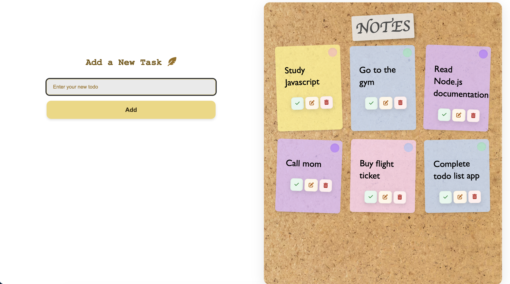
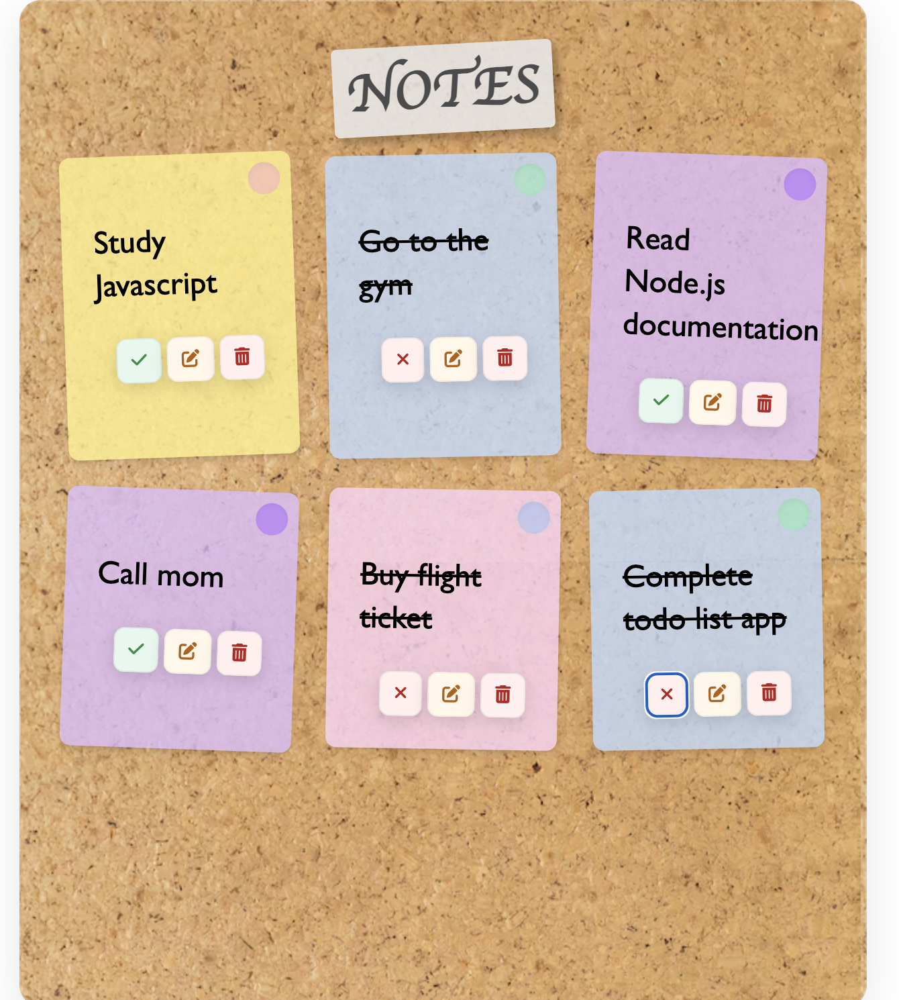
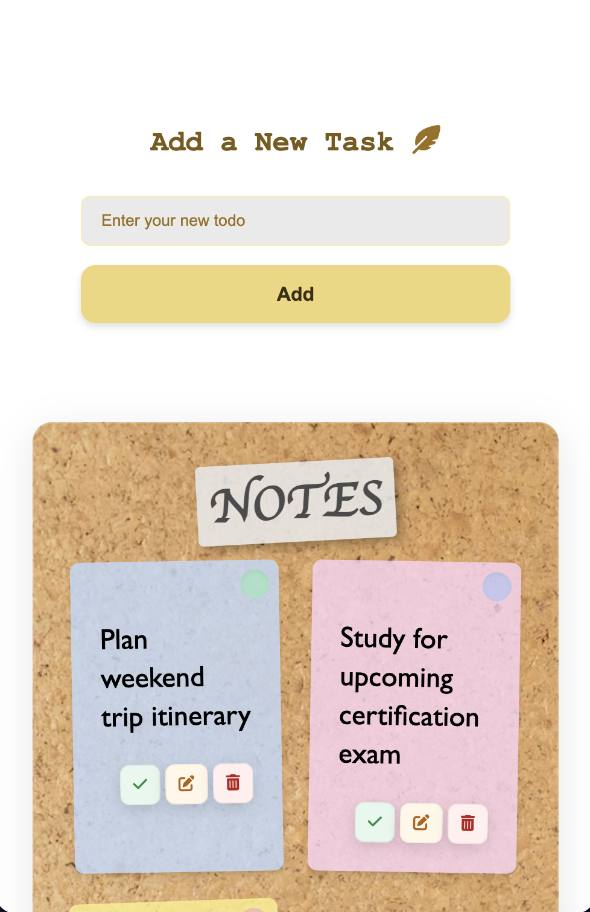

# To-Do List App

A colorful and interactive sticky note style To-Do List application built with **JavaScript**, **HTML**, and **CSS**.Create colorful notes, mark tasks as complete, edit them, and delete them with an intuitive interface.

### File Structure

```
to-do-list/
├── index.html
├── css/
│   └── style.css
├── script.js
├── img/
│
└── README.md
```

## Usage

1. **Adding a Task**:

   - Type your task in the input field
   - Click "Add" button
   - A colorful sticky note will appear

2. **Completing a Task**:

   - Click the green checkmark button
   - The task will be crossed out
   - Click the red X to unmark it

3. **Editing a Task**:

   - Click the orange edit button
   - Modify the text in the input field
   - Click edit again to save changes

4. **Deleting a Task**:

   - Click the red trash button
   - The note will be permanently removed

5. **Alert**:
   - If you already have the same task in your list, you will get an alert.
   - If you enter an empty task, you will get an alert.
   - if you try to rename a task to one that already exists you will get an alert

### Installation

1. Clone or download this repository
2. Open `index.html` in your web browser
3. Start adding your tasks!

## Screenshots


<br>



## Deployment

This is my project live on GitHub Pages.<br>
https://burcugns.github.io/to-do-list/
